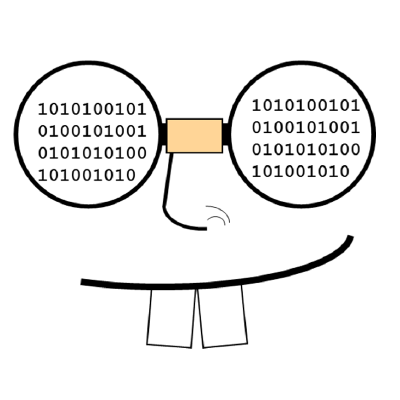

```{r setup, include=FALSE}
htmltools::tagList(rmarkdown::html_dependency_font_awesome())
```

\

<p float="left" align="middle">
  
</p>

\

Geek-lunch organization group several graduate students at University Laval, most of them studying in ecology. Graduate students present sets of skill that might be useful for other students during their graduate studies. This organization is led by students and for students. 

Here is the [repository <i class="fab fa-github-square" style="font-size:16px"></i>](https://github.com/geek-lunch/workshops) of Geek-lunch organization, where students from University Laval (Qc, Canada) store R scripts on tips about coding, packages skills in R statistical software, but also sometimes other stuff related to biological sciences. 

This repository and webpage is updated and maintained by [F. Dery <i class="fab fa-github-square" style="font-size:16px"></i> ](https://github.com/florentdery). 