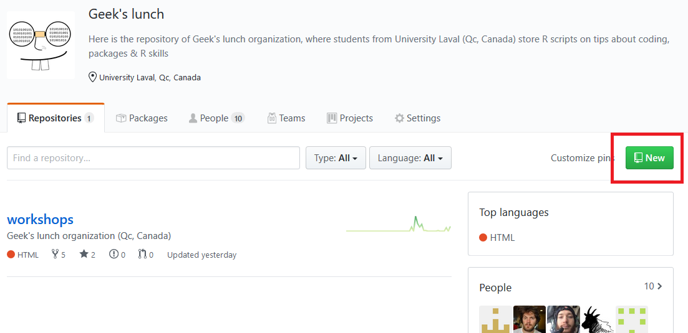
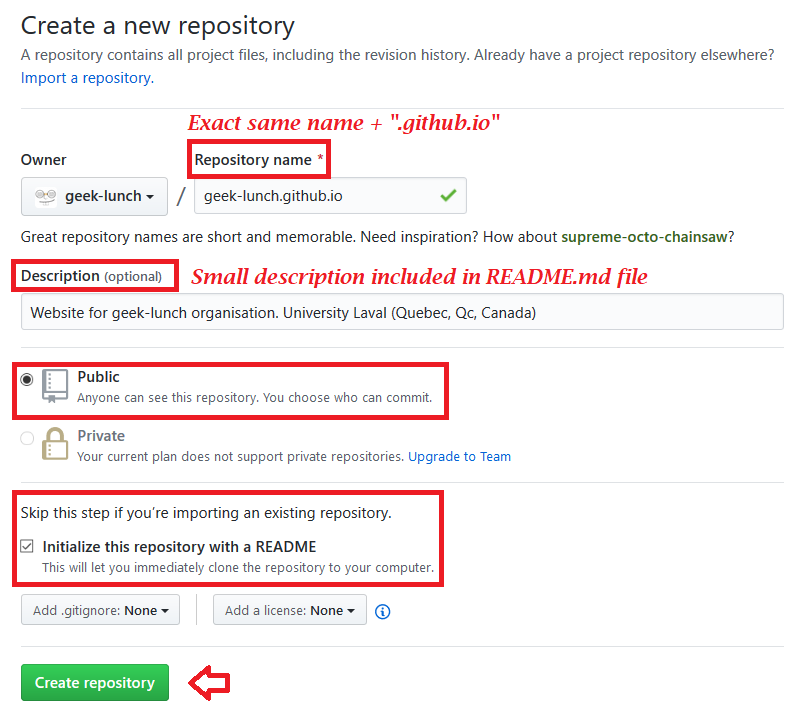
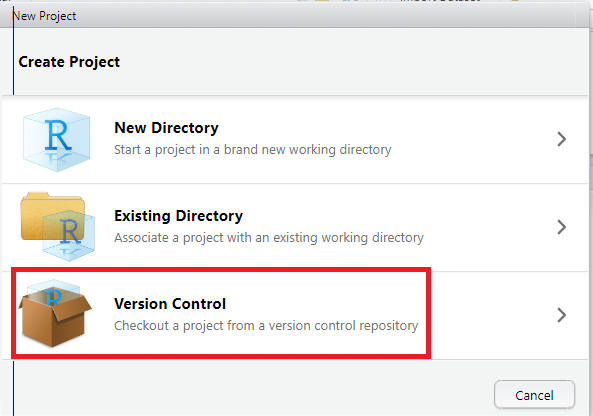

```{r setup, include=FALSE}
htmltools::tagList(rmarkdown::html_dependency_font_awesome())
```

\

This website has been built for a lunch workshop led by Geek-Lunch Organisation. 
Base ("model") files to build a website can be found [here](https://github.com/geek-lunch/workshops), under the websites_with_rmarkdown folder. 

\
\

# List of ingredients 

- 1 _site.yml
- 1 style.css
- 1 index.rmd (that will be knitted as a .html)
- Sprinkles and icing to taste

\
\

# Preparation

## Filling

1. Create a GitHub Repository with this format : "username.github.io"

  
  
<p float="left" align="middle">
   
</p>

\

2. Create a `R` project with Version control in a new folder that you'll create by cloning that 'username.github.io" repository on your local computer 

<p float="left" align="middle">
  
</p>

<p float="left" align="middle">
  
  
  
</p>

\

3. Make sure that your `R` project is ready to build websites

<p float="left" align="middle">
  
</p>

You might need to restart Rstudio

\

4. Generate files needed to create your websites (see [list of ingredients](#list-of-ingredients))

<p float="left" align="middle">
  
</p>

\
\

## Toping 

Now it is time for creation. You can now modify `style.css` file to your taste, add content, graphs, pictures, `R` chunks, whatever!

Here is where you can play with `R`, `Markdown`, `html` and `css` syntaxes, to name a few. You can also stick with Rmarkdown, If it is what's working for you.

You can also add Other pages, As I did [here](https://geek-lunch.github.io/), As long as they are specified in you `_site.yml` file.

\

## Oven instructions

Once you are satisfied, build your website, push commits to your repository, and your website (or cake-site?) will be available at https://username.github.io/! 