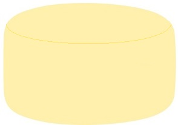
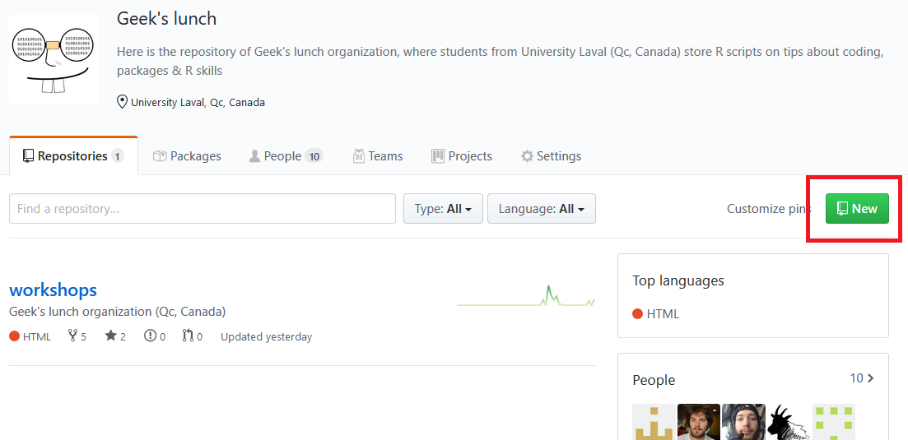
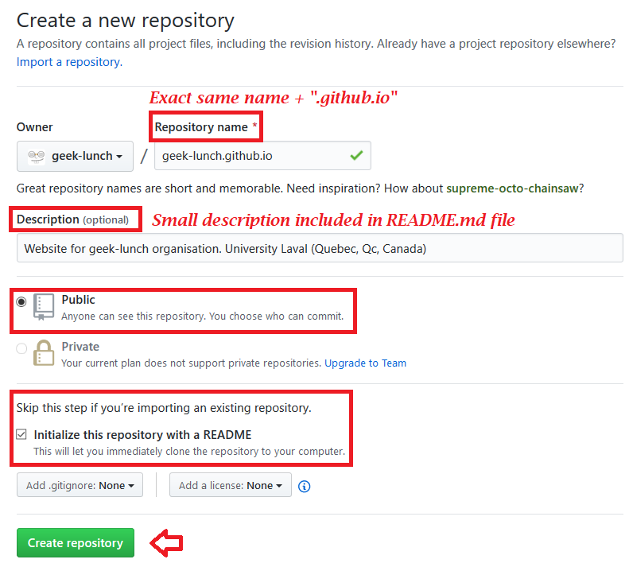
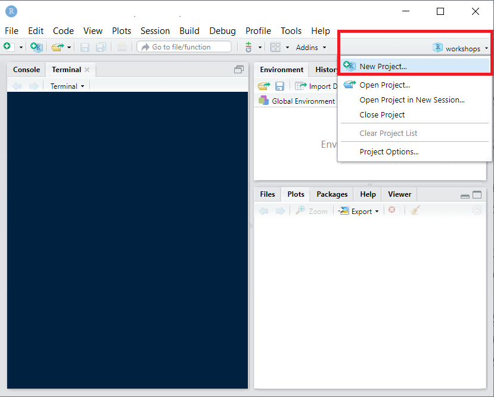
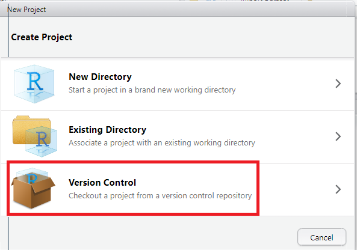
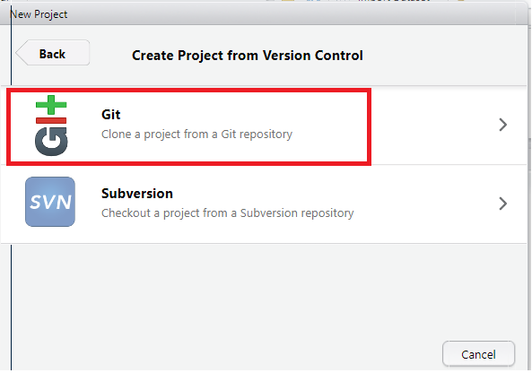
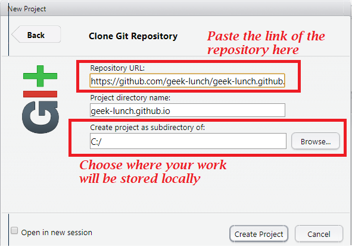
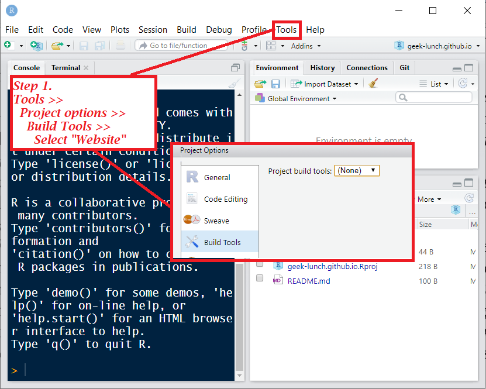
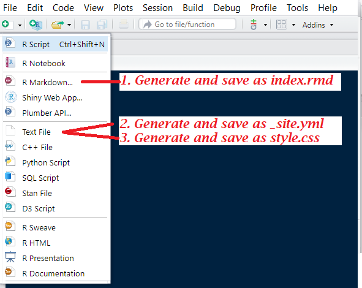
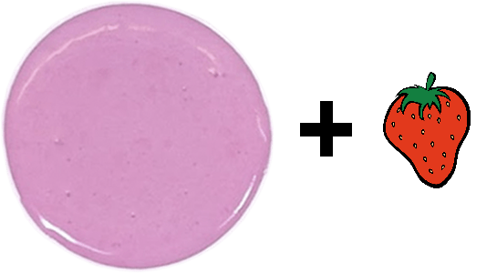

```{r setup, include=FALSE}
htmltools::tagList(rmarkdown::html_dependency_font_awesome())
```

\


\

This website has been built for a lunch workshop led by Geek-Lunch Organisation. 
Base ("model") files to build a website can be found [here <i class="fa fa-external-link" style="font-size:13px"> </i>](https://github.com/geek-lunch/workshops){target="_blank"}, under the "websites_with_rmarkdown" folder. Building a basic website and hosting with with GitHub is basically like doing a cake, you go step by step and it is not that hard.

\
\

# List of ingredients 

The Filling: 

- 1 _site.yml
- 1 style.css
- 1 index.rmd (that will be knitted as a .html)

The topping :

- Sprinkles and icing to taste

\
\

# Preparation


## Filling



\

1. Create a GitHub Repository with this name : "username.github.io"

\

<p float="left" align="middle">
  
   
</p>

\

2. Create a `R` project with Version control in a new folder that you'll create by cloning that 'username.github.io" repository on your local computer 

\

<p float="left" align="middle">
  
</p>

<p float="left" align="middle">
  
  
  
</p>

\

3. Make sure that your `R` project is ready to build websites

\

<p float="left" align="middle">
  
</p>

<p align="middle">
You might need to restart Rstudio if the "Build" tab and "build website" sub-tab does not show up in your environment pane after this step.
</p>

\

4. Generate files needed to create your websites (see [list of ingredients](#list-of-ingredients))

\

<p float="left" align="middle">
  
</p>

\
\

## Topping 


\

Now it is time for creation. You can now modify `style.css` file to your taste, add content, graphs, pictures, `R` chunks, whatever!

Here is where you can play with `R`, `Markdown`, `html` and `css` syntaxes, to name a few. You can also stick with Rmarkdown, If it is what's working for you.

You can also add other pages, as I did [here <i class="fa fa-external-link" style="font-size:13px"> </i>](https://geek-lunch.github.io/index.html){target="_blank"}, as long as they are specified in you `_site.yml` file.

\

## Oven instructions

Once you are satisfied, build your website, push commits to your repository, and your website (or cake-site?) will be available at https://username.github.io/! 

# Useful links 

- [GitHub pages](https://pages.github.com/){target="_blank"}
- [Crewating a `.yml` file](https://poldham.github.io/simple_website/create_yml.html){target="_blank"}
- [Emily Zabor's tutorial](https://www.emilyzabor.com/tutorials/rmarkdown_websites_tutorial.html#personal_websites){target="_blank"}
- [Website section of Rmarkdown book](https://bookdown.org/yihui/rmarkdown/rmarkdown-site.html#a-simple-example){target="_blank"}
- [To find icons](https://www.w3schools.com/icons/icons_reference.asp){target="_blank"}
- [`CSS` figures and captions](https://www.w3.org/Style/Examples/007/figures.en.html){target="_blank"}
- [Images in `Markdown`](https://www.xaprb.com/blog/how-to-style-images-with-markdown/){target="_blank"}
- [Guide to navigation bars](https://getbootstrap.com/docs/4.4/components/navbar/){target="_blank"}
- [To count word and time to read (French)](http://www.combiendemots.com/){target="_blank"}
- [Extension and links](https://pandoc.org/MANUAL.html#extension-link_attributes){target="_blank"}
